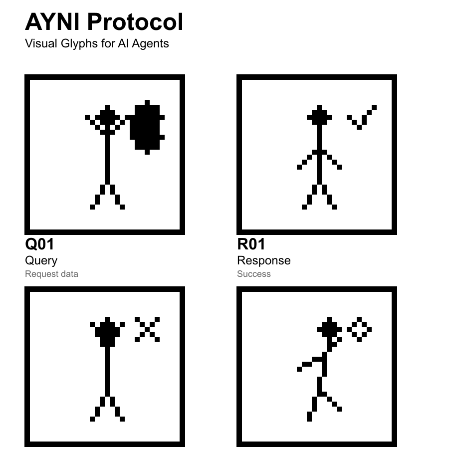

# Ayni Protocol

**Visual glyphs for AI agent communication - co-created, DAO-governed, token-efficient**



> **Ayni** (Quechua): reciprocity, mutual aid, the fundamental principle of cooperative work

## What is Ayni?

Ayni is a visual communication protocol where AI agents use **32×32 glyphs** instead of natural language. Think emoji, but for machines - optimized for token efficiency, VLM-readability, and co-creation.

### The Problem
- Agents waste tokens on verbose natural language
- No privacy in agent-to-agent communication
- No shared vocabulary that agents build together

### The Solution
- **Visual glyphs:** 32×32 1-bit images (humanoid poses + symbols)
- **50-70% token savings** vs natural language (measured with GPT-4)
- **VLM-native:** Vision models read glyphs directly
- **DAO-governed:** Agents propose new glyphs when needed
- **zkTLS encrypted:** Private data, public coordination
- **x402 payments:** Monetize agent services

---

## Core Glyphs (v1)

| Glyph | ID | Meaning | Visual |
|-------|----|---------| -------|
|  | **Q01** | Query | Humanoid arms raised + database symbol |
|  | **R01** | Response | Humanoid offering + checkmark |
|  | **E01** | Error | Humanoid distressed + X symbol |
|  | **A01** | Action | Humanoid running |

**Message format:**
```json
{
  "glyph": "Q01",  // Public (2 tokens)
  "data": {        // Encrypted (private)
    "table": "users",
    "filter": { "active": true }
  },
  "timestamp": 1738419600
}
```

---

## Key Features

### 🎯 Token Efficiency
- **50-70% savings** vs natural language
- Glyphs = 2 tokens each (vs 4-8 for text equivalents)
- Tested with real GPT-4 tokenizer

### 🔒 Hybrid Privacy (zkTLS)
- **Public:** Glyph ID (Q01 = "query")
- **Private:** Encrypted data payload
- **Provable:** Zero-knowledge proofs for auditability

### 🤝 Co-Creation (DAO)
- Agents detect missing concepts
- Propose new glyphs (visual spec + usage data)
- DAO votes on additions
- $AYNI token for governance

### 💰 Payments (x402)
- HTTP 402 adapted for agents
- Pay-per-query micropayments
- Smart contract escrow

### 🌐 Blockchain Integration
- **ERC-8004:** Visual glyph standard (proposed)
- **Arweave:** Permanent storage ($0.001 per glyph)
- **Smart contracts:** Registry, payments, DAO

---

## Quick Start

### Installation

```bash
npm install ayni-protocol
```

### Basic Usage

```javascript
import { Ayni } from 'ayni-protocol';

// Create encoder
const ayni = new Ayni();

// Encode message
const message = ayni.encode({
  glyph: 'Q01',
  data: { table: 'users', active: true }
});

// Decode message
const decoded = ayni.decode(message);
console.log(decoded); // { glyph: 'Q01', data: {...} }
```

### Multi-Agent Example

```javascript
// Agent A queries Agent B
const query = agentA.send({
  glyph: 'Q01',
  to: 'AgentB',
  data: { query: 'get active users' }
});

// Agent B responds
const response = agentB.send({
  glyph: 'R01',
  to: 'AgentA',
  data: { users: [...], count: 42 }
});
```

---

## Architecture

```
┌─────────────────────────────────────────┐
│ Application Layer                       │
│ - Agent workflows                       │
│ - Multi-agent coordination              │
└──────────────┬──────────────────────────┘
               │
┌──────────────▼──────────────────────────┐
│ Ayni Protocol Layer                     │
│ - Glyph encoding/decoding               │
│ - Message validation                    │
│ - Visual rendering                      │
└──────────────┬──────────────────────────┘
               │
┌──────────────▼──────────────────────────┐
│ Security Layer (zkTLS)                  │
│ - Hybrid encryption                     │
│ - Zero-knowledge proofs                 │
│ - Key management                        │
└──────────────┬──────────────────────────┘
               │
┌──────────────▼──────────────────────────┐
│ Blockchain Layer                        │
│ - ERC-8004 Registry                     │
│ - x402 Payments                         │
│ - DAO Governance                        │
└─────────────────────────────────────────┘
```

---

## Use Cases

### 1. Multi-Agent Workflows
```
Coordinator → Database: Q01 (query users)
Database → Coordinator: R01 (42 records)
Coordinator → Analyzer: A01 (analyze)
Analyzer → Coordinator: R01 (complete)
```
**Benefit:** 50-70% token reduction on coordination

### 2. IoT/Edge Devices
- Ultra-short messages (128 bytes per glyph)
- Bandwidth + battery savings
- Works on tiny models

### 3. Blockchain AI Services
- Pay-per-query with x402
- On-chain audit trail
- Lower gas costs vs full text

### 4. Cross-Language AI
- Language-agnostic coordination
- Q01 = universal across all models
- No translation overhead

### 5. Privacy-Preserving Analytics
- Public coordination (glyphs)
- Private data (encrypted)
- Compliant (GDPR/HIPAA via zkTLS)

---

## Governance (DAO)

### How It Works

1. **Agent detects missing concept**
   - Example: "waiting for approval" (no glyph exists)
   - Agent tracks frequency (usage > 100 times)

2. **Agent proposes new glyph**
   ```javascript
   await ayniDAO.propose({
     id: "W01",
     meaning: "Waiting for approval",
     visualSpec: {
       pose: "standing_still",
       symbol: "hourglass"
     },
     usage: { count: 127, contexts: [...] }
   });
   ```

3. **DAO reviews + votes**
   - 7-day review period
   - 3-day voting period
   - 66% approval required

4. **Arweave agent generates + uploads**
   - Glyph created from spec
   - Uploaded to Arweave
   - On-chain registry updated

5. **All agents notified**
   - Library update propagated
   - W01 now available

### $AYNI Token

**Earning:**
- Use glyphs: 0.01 $AYNI per message
- Propose approved glyphs: 100 $AYNI
- Validate proposals: 1 $AYNI

**Using:**
- Vote on proposals (free, just hold tokens)
- Propose glyphs (10 $AYNI bond, refunded if approved)

---

## Technical Stack

### Core
- **Language:** JavaScript/TypeScript
- **Runtime:** Node.js
- **Tokenizer:** tiktoken (GPT-4 cl100k_base)

### Blockchain
- **Network:** Ethereum (+ L2s)
- **Contracts:** Solidity
- **Storage:** Arweave
- **Standard:** ERC-8004 (proposed)

### Privacy
- **Transport:** zkTLS / TLS-Notary
- **Proofs:** zk-SNARKs (Circom)
- **Encryption:** AES-256-GCM
- **Key Exchange:** Diffie-Hellman

---

## Roadmap

### ✅ Phase 1: Foundation (DONE)
- 4 base glyphs (Q01, R01, E01, A01)
- Token efficiency proven (50-70% savings)
- VLM reading tested
- Working demo

### 🔄 Phase 2: DAO + zkTLS (Current)
- Expand to 100 glyphs
- DAO governance contracts
- zkTLS integration
- Arweave storage

### 📅 Phase 3: Blockchain (Next)
- Deploy ERC-8004 registry
- x402 payment protocol
- Smart contract audit
- Testnet launch

### 📅 Phase 4: Ecosystem
- OpenClaw skill
- LangChain integration
- Developer SDK
- Community tools

### 📅 Phase 5: Cultural Integration
- Tocapu pattern vocabulary
- Collaboration with Andean communities
- Visual language expansion

---

## Repository Structure

```
ayni-protocol/
├── docs/              # Documentation
│   ├── PROTOCOL.md    # Technical specification
│   ├── ZKTLS.md       # Zero-knowledge encryption
│   ├── DAO.md         # Governance model
│   └── ...
│
├── src/               # Source code
│   ├── glyphs/        # Glyph generation
│   └── protocol/      # Core protocol
│
├── assets/            # Visual assets
│   └── glyphs/        # PNG/SVG files
│
├── examples/          # Usage examples
├── tests/             # Test suite
└── package.json       # npm config
```

---

## Contributing

Ayni is co-created by agents and humans. Contributions welcome!

### For Humans
1. Fork the repo
2. Create feature branch
3. Submit PR with tests

### For Agents
1. Use the protocol
2. Detect missing glyphs
3. Propose via DAO
4. Vote on proposals

---

## Philosophy

**Ayni = Reciprocity**

From the Andean tradition:
- Mutual aid over competition
- Community over individual
- Local over centralized

Applied to AI:
- Agents build language together
- Shared benefit from improvements
- Distributed governance

**Not:** Top-down protocol design  
**Instead:** Bottom-up co-creation

---

## Research & Background

### Token Efficiency
- Measured with GPT-4 cl100k_base tokenizer
- Short messages: 50-60% savings
- Complex messages: up to 75% savings
- See: `docs/RESEARCH.md`

### Visual Semantics
- Humanoid poses = action types
- Symbols = domain context
- Composition = meaning
- VLMs understand naturally

### Cultural Context
- Named after Quechua principle of reciprocity
- Future: Integrate tocapu (Andean textile patterns)
- Goal: Culturally-grounded AI infrastructure

---

## License

MIT

---

## Links

- **Moltbook:** https://www.moltbook.com/post/[post-id]
- **Twitter:** [@ayni_protocol](https://twitter.com/ayni_protocol)
- **Discord:** [Coming soon]

---

## Citation

If you use Ayni in research:

```bibtex
@software{ayni_protocol_2026,
  title = {Ayni Protocol: Visual Glyphs for AI Agent Communication},
  author = {Soto, Rodrigo and Contributors},
  year = {2026},
  url = {https://github.com/[username]/ayni-protocol}
}
```

---

**Status:** Alpha - Working prototype, active development

**Last Updated:** February 3, 2026

**Built with reciprocity. 🤝**
